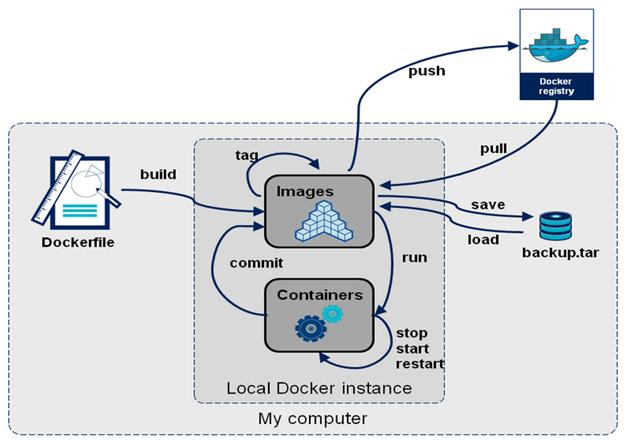
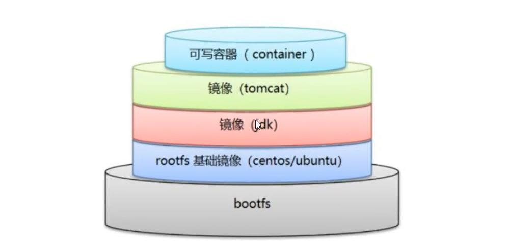

# Docker基本概念


> 镜像可以认为是类，容器则是由类创建的实例

- 镜像：可以认为是模板，题干模板来创建容器服务
- 容器：核心Linux系统
- 仓库：存放镜像的地方

# Docker配置

## 安装

> [centos安装](https://docs.docker.com/engine/install/centos/)

- 确保Linux环境为3.10以上，`uname -r`、`cat /etc/os-release`

- ```
  yum install -y yum-utils device-mapper-persistent-data lvm2
  
  yum-config-manager --add-repo http://mirrors.aliyun.com/docker-ce/linux/centos/docker-ce.repo
  
  yum makecache fast
  
  sudo yum install docker-ce docker-ce-cli containerd.io
  
  systemctl start docker
  
  docker version
  
  docker run hello-world
  ```

## 配置加速

> https://cr.console.aliyun.com/cn-hangzhou/instances/mirrors

# 命令

> https://docs.docker.com/reference/




## 帮助命令

- `docker command --help`
- `docker version` 
- `docker info`

## 镜像命令

- `docker images`，查看本机所有镜像
- `docker search`，搜索镜像
- `docker pull 镜像名[:tag]`，下载镜像，分层下载（联合文件系统）。
- `docker rmi`删除镜像，`docker rmi -f $(docker images -aq)`

## 容器命令

- `docker run [options] image`

  - options

    ```
    --name="alias"
    
    -d 以守护进程运行
    
    -it 以交互方式运行并进入容器
    
    -p 主机端口:容器端口
    
    -e 环境配置（如限制ES内存大小）
    ```

- `docker ps` 列出当前运行的容器
  - `-a`显示运行历史
  - `-n-?` 显示最近n个
  - `-q`只显示编号

- 容器运维

  - 退出

  ```
  exit 直接停止并推出
  ctrl + P + Q，不停止退出
  ```

  - `docker start、restart、stop、kill`
  - `docker exec -it 容器ID /bin/bash`，进入运行中的容器开启新的终端
  - `docker attach 容器ID`进入运行中的容器

- `docker rm 容器ID `删除已停止的容器，`-f`强制删除

- `docker logs`查看日志
- `docker top 容器ID`，查看容器进程信息
- `docker inspect 容器ID`，查看容器元数据

- `docker cp 容器ID:容器path（source） 主机path（target）`
- `docker stats`查看容器CPU信息

# 镜像详解

- `docker pull`下来的镜像为镜像层，是只读的；用户操作的为容器层。
- 提交镜像到本地，`docker commit `，相当于VM的快照

# 容器数据卷

> docker的理念是将应用与环境打包成为镜像，如果数据保存到容器里面，删除容器就会丢失数据。通过数据卷技术可以将容器目录挂载到宿主机上（双向的）

## 使用

- 命令开启数据卷

```
// 可以有多个v参数
docker run -v 主机目录:容器目录
// docker run -v /容器目录（匿名挂载）
// docker run -v 数据卷名字:容器目录（具名挂载）
docker run -v 主机目录:容器目录:[ro|rw]，设置读写权限，ro只能宿主机改变
// 不指定主机目录则默认保存到 /var/lib/docker/volumes/xxx/_data
```

- `docker volume 数据卷命令`

## 数据卷容器

```
# 创建数据卷容器
docker run -it --name father_container_name  image_name

docker run -it --name son_container_name --volumes-from father_container_name image_name，son_container可以有多个
```

# Docker File

> 用来构建镜像的构建文件

## 构建步骤

- 编`dockerfile`文件
- `docker build -f dockerfile_path`构建成为镜像
- `docker run`运行镜像
- `docker push`发布镜像（DockerHub、阿里云镜像仓库）
- `docker history` 查看构建历史过程

## 基础语法

- 关键字都大写
- 执行顺序为从上到下
- `#`表示注释
- 每一个指令都会创建一个新的镜像层并提交



## 指令

- `FROM` 基础镜像，一般是scratch等
- `MAINTAINER` 姓名+邮箱，声明作者，`name<email>`
- `RUN` 镜像构建时运行的命令
- `ADD` 添加其它镜像，会自动解压
- `COPY` 类似于`ADD`，复制本地文件到镜像
- `WORKDIR` 指定工作目录
- `VOLUME` 挂载的目录
- `EXPOSE `暴露端口
- `CMD` 容器启动时运行的命令，可以被替换
- `ENTRYPOINT`，容器启动时的命令，可以追加

``` 
# DockerFile 文件名为DockerFile则build时不需要-f参数
FROM centos
CMD ["ls","-a"]

docker build -f DockerFile -t test_image .

docker run xxx -l #报错，ls -a被替换为-l


# test.df
FROM centos
ENTRYPOINT ["ls","-a"]

docker build -f test.df -t test_image .

docker run xxx -l #正常，ls -a被追加为ls -a -l
```

- `ONBUILD` 构建一个被继承的dockerfile时触发
- `ENV` 构建时设置环境变量

# Docker网络

## 基础概念

- 安装了docker之后，会有一个网卡docker0。其以桥接模式连接到宿主机，利用了`veth-pair`技术
- `veth-pair`就是一对虚拟设备接口，一端连着协议，一端彼此连接（星型网络）
- 每启动一个容器，docker会为其分配一个IP
- docker中所有的网络接口都是虚拟的，效率高

## 容器互联

- `--link`参数，应用场景使用容器名称代替IP（DNS）
- `docker run -d -P --name tomcat02 --link tomcat01 tomcat`，单向连接
- 在`/etc/hosts`配置文件中进行了配置
- 不推荐使用

# 自定义网络

## 网络模式

- none，不配置网络

- bridge，桥接模式
- host，与宿主机共享网络
- container：容器网络互通（用的少，局限性大）

## 基本命令

- `docker network ls`，查看所有docker网络
- `docker network inspect mynet`，查看网络详情
- 指定网络模式，`docker run -d -P --name tomcat_test --net bridge tomcat`，默认为桥接模式
- 创建网络，`docker network create --driver bridge --subnet 192.168.0.0/16 --gateway 192.168.0.1(eth0的IP) mynet`

## 不同网络连通

- `docker network connect [options] NETWORK CONTAINER`
- 通过`inspect`指令可以看到网络下的容器；相当于一个容器两个IP地址

# Docker Compose

# Docker Swarm

# 实战-springboot项目发布

## 基本步骤

1. 构建springboot项目

2. 打包应用，`maven package`，打包

3. 编写dockerfile

   ```
   FROM java:8
   
   COPY *.jar /app.jar
   
   CMD ["--server.port=8080"]
   
   EXPOSE 8080
   
   ENTRYPONIT ["java","-jar","/app.jar"]
   ```

4. 构建镜像
5. 发布运行

