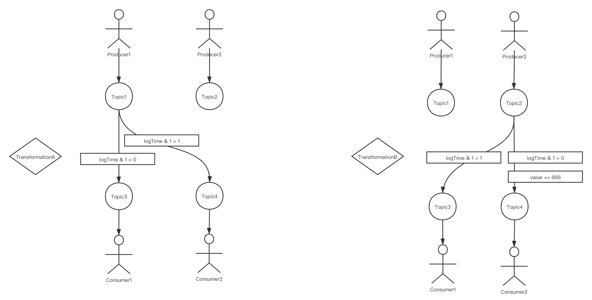
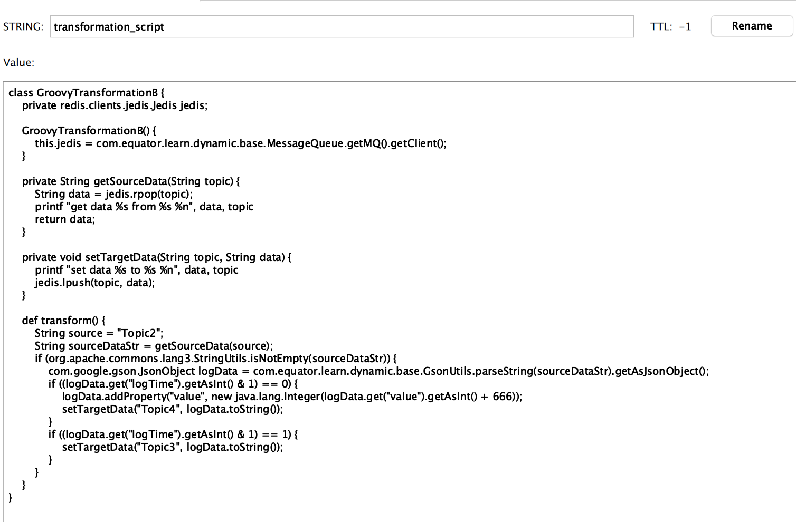
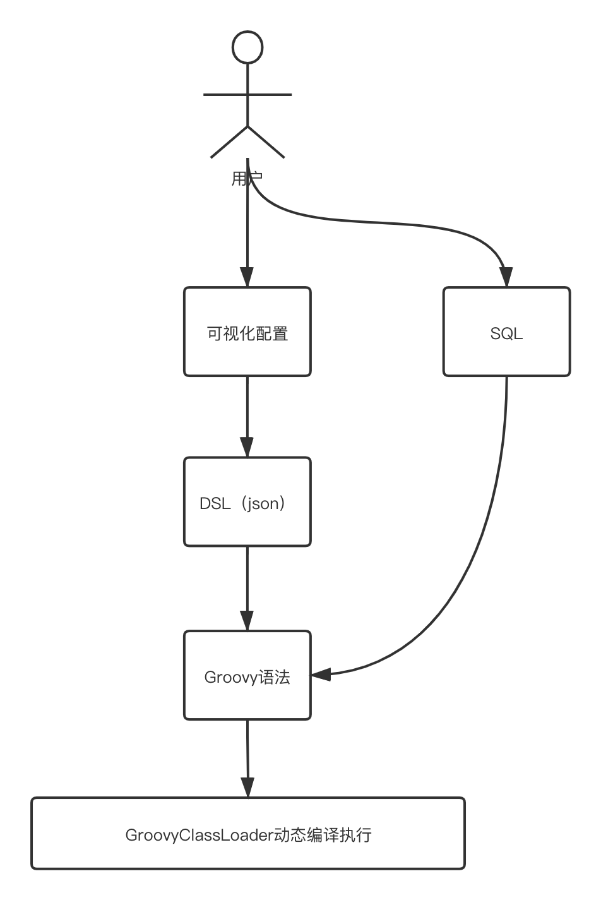

# 怎样动态改变程序的行为

# 前言

- 在大数据环境下的流式任务中，如果任务配置发生了改变，任务往往需要实现动态部署功能以达到动态地改变任务行为的效果。为什么不能直接kill旧的进程然后重启服务呢，因为重启任务花费时间过长，有可能导致流式数据断流（流式数据是无边界的，源源不断的数据），下游服务感知到数据断流之后会触发报警等其它我们不希望发生的动作。
- 本文尝试利用一个小Demo，从字节码增强、Groovy动态编译、Groovy+DSL三个循序渐进的角度实现动态改变程序行为的目的。

# Demo说明

- 利用redis的list作为消息队列，list的key就是topic。有两个生产者Producer1、Producer2分别源源不断地往Topic1、Topic2中生成数据，同时有两个消费者Consumer1、Consumer2分别不停止地从Topic3、Topic4中消费数据。一但消费者无消息可以消费，超过重试次数之后就会被饿死。
- 当前有一个**运行中的**数据转换TransformationA，它从Topic1获取数据，并判断如果数据的logTime是奇数，就往Topic3写入，否则往Topic4写入。此外有一个**待启动的**数据转换TransformationB，它从Topic2获取数据，并判断如果数据的logTime是偶数，则往Topic3写入，否则将数据的value字段自增666，往Topic4写入。
- 我们的目的是在消费者没有感知的前提下，将TransformationA的逻辑转变为TransformationB的逻辑。



## 消息格式

```java
public class LogData {
    /**
     * 日志来源
     */
    private String source;
    /**
     * 日志生产时间
     */
    private long logTime;
    /**
     * 日志内容
     */
    private String data;
    /**
     * 其它一些内容
     */
    private int value;

    public LogData() {
    }

    public LogData(String source, long logTime, String data, int value) {
        this.source = source;
        this.logTime = logTime;
        this.data = data;
        this.value = value;
    }
  	// 省略setter、getter方法
}
```

## 生产者

```java
public class Producer implements Runnable {
    private String topic;
    private Jedis jedis;

    public Producer(String topic) {
        this.topic = topic;
        jedis = MessageQueue.getMQ().getClient();
    }

    private void produce() {
        LogData logData = new LogData();
        logData.setSource(topic);
        logData.setLogTime(System.currentTimeMillis());
        logData.setData(String.format("一些数据 %d", System.currentTimeMillis()));
        logData.setValue(0);
        Gson gson = new Gson();
        String logStr = gson.toJson(logData);
        jedis.lpush(topic, logStr);
        log.info("生产数据 {}", logStr);
    }

    @Override
    public void run() {
        log.info("{} topic 的生产者启动...", topic);
        while (true) {
            produce();
            try {
                Thread.sleep(2 * 1000);
            } catch (InterruptedException e) {
                e.printStackTrace();
            }
        }
    }

    public static void main(String[] args) {
      	// 生产者孜孜不倦地生产数据
        new Thread(new Producer("Topic1")).start();
        new Thread(new Producer("Topic2")).start();
    }
}
```

## 消费者

```java
public class Consumer implements Runnable {
    private final int MAX_TRY = 5;
    private String topic;
    private Jedis jedis;

    public Consumer(String topic) {
        this.topic = topic;
        jedis = MessageQueue.getMQ().getClient();
    }

    private boolean consume() {
        String logStr = jedis.rpop(topic);
        if (StringUtils.isEmpty(logStr)) {
            return false;
        }
        log.info("消费数据 {}", logStr);
        return true;
    }

    @Override
    public void run() {
        log.info("{} topic 的消费者启动...", topic);
        while (true) {
            if (!consume()) {
                boolean hungry = true;
                for (int retryTimes = 1; retryTimes < MAX_TRY; retryTimes++) {
                    if (consume()) {
                        // 如果重试一定次数还是消费不到数据，消费者就会饿到狗带
                        hungry = false;
                        break;
                    }
                    try {
                        Thread.sleep(5 * 1000);
                    } catch (InterruptedException e) {
                        e.printStackTrace();
                    }
                }
                if (hungry) {
                    log.error("饿饿QAQ");
                    break;
                }
            }
        }
        log.info("{} topic 的消费者停止...", topic);
    }

    public static void main(String[] args) {
        // 下游消费数据
        new Thread(new Consumer("Topic3")).start();
        new Thread(new Consumer("Topic4")).start();
    }
}
```

## 数据转换

- TransformationA

```java
public class TransformationA implements Runnable {
    private Jedis jedis;

    public TransformationA() {
        this.jedis = MessageQueue.getMQ().getClient();
    }

    private void start() {
        log.info("转换A启动，有点慢...");
        try {
            Thread.sleep(1000 * 15);
        } catch (InterruptedException e) {
            e.printStackTrace();
        }
        log.info("转换A终于启动了！");
        while (true) {
            try {
                Thread.sleep(1000);
            } catch (InterruptedException e) {
                e.printStackTrace();
            }
            transform();
        }
    }

    private String getSourceData(String topic) {
        String data = jedis.rpop(topic);
        log.info("TransformA getSourceData --- topic: {}, data: {}", topic, data);
        return data;
    }

    private void setTargetData(String topic, String data) {
        log.info("TransformA setTargetData --- topic: {}, data: {}", topic, data);
        jedis.lpush(topic, data);
    }

    public void transform() {
        String source = "Topic1";
        String sourceDataStr = getSourceData(source);
        if (org.apache.commons.lang3.StringUtils.isNotEmpty(sourceDataStr)) {
            LogData logData = GsonUtils.fromJson(sourceDataStr, LogData.class);
            if ((logData.getLogTime() & 1) == 0) {
                setTargetData("Topic3", sourceDataStr);
            }
            if ((logData.getLogTime() & 1) == 1) {
                setTargetData("Topic4", sourceDataStr);
            }
        }
    }

    @Override
    public void run() {
        start();
    }

    public static void main(String[] args) {
        new Thread(new TransformationA()).start();
    }
}
```

- TransformationB

```java
public class TransformationB implements Runnable {
    private Jedis jedis;

    public TransformationB() {
        this.jedis = MessageQueue.getMQ().getClient();
    }

    private void start() {
        log.info("转换B启动，有点慢...");
        try {
            Thread.sleep(1000 * 15);
        } catch (InterruptedException e) {
            e.printStackTrace();
        }
        log.info("转换B终于启动了！");
        while (true) {
            try {
                Thread.sleep(1000);
            } catch (InterruptedException e) {
                e.printStackTrace();
            }
            transform();
        }
    }

    private String getSourceData(String topic) {
        String data = jedis.rpop(topic);
        log.info("TransformA getSourceData --- topic: {}, data: {}", topic, data);
        return data;
    }

    private void setTargetData(String topic, String data) {
        log.info("TransformA setTargetData --- topic: {}, data: {}", topic, data);
        jedis.lpush(topic, data);
    }

    private void transform() {
        String source = "Topic2";
        String sourceDataStr = getSourceData(source);
        if (org.apache.commons.lang3.StringUtils.isNotEmpty(sourceDataStr)) {
            com.google.gson.JsonObject logData = com.equator.learn.dynamic.base.GsonUtils.parseString(sourceDataStr).getAsJsonObject();
            log.info("data: {}", logData);
            if ((logData.get("logTime").getAsInt() & 1) == 0) {
                logData.addProperty("value", new java.lang.Integer(logData.get("value").getAsInt() + 666));
                setTargetData("Topic4", logData.toString());
            }
            if ((logData.get("logTime").getAsInt() & 1) == 1) {
                setTargetData("Topic3", logData.toString());
            }
        }
    }

    @Override
    public void run() {
        start();
    }

    public static void main(String[] args) {
        new Thread(new TransformationB()).start();
    }
}
```

# 字节码增强

> 说起动态部署，我第一时间想到的是字节码增强技术。利用JPDA（Java Platform Debugger Architecture）提供的能力，我们可以在程序运行期间动态地改变字节码并实现重新加载，这样就可以改变程序的行为了。可以想象一下，如果如果你能运行期间动态修改字节码并重新加载，这和重新写了一个程序并重启的效果是一样的，但是我们悄咪咪地在不停机的前提下改变了程序的行为。

## 原理简介

- Instrument是JVM提供的一个可以修改已加载类的类库，利用它可以修改class文件
- Agent相当于是一个插件，借助Agent的能力将Instrument注入到JVM中（通过Attach Api）

## Instrument 字节码转换器

```java
public class ByteCodeTransformer implements ClassFileTransformer {
    // @SneakyThrows 巨坑！！！有异常不抛出
    @Override
    public byte[] transform(ClassLoader loader, String className, Class<?> classBeingRedefined, ProtectionDomain protectionDomain, byte[] classfileBuffer) throws IllegalClassFormatException {
        try {
            log.info("替换字节码");
            ClassPool classPool = ClassPool.getDefault();
            CtClass ctClass = classPool.get("com.equator.learn.dynamic.ordinary.TransformationA");
            CtMethod ctMethod = ctClass.getDeclaredMethod("transform");
            // 注意事项：setBody参数需要是语句或者代码块
            ctMethod.setBody("{\n" +
                    "        String source = \"Topic2\";\n" +
                    "        log.info(\"转换数据源：{}\", source);\n" +
                    "        String sourceDataStr = getSourceData(source);\n" +
                    "        if (org.apache.commons.lang3.StringUtils.isNotEmpty(sourceDataStr)) {\n" +
                    "            com.google.gson.JsonObject logData = com.equator.learn.dynamic.base.GsonUtils.parseString(sourceDataStr).getAsJsonObject();\n" +
                    "            log.info(\"data: {}\", logData);\n" +
                    "            if ((logData.get(\"logTime\").getAsInt() & 1) == 0) {\n" +
                    "                logData.addProperty(\"value\", new java.lang.Integer(logData.get(\"value\").getAsInt() + 666));\n" +
                    "                setTargetData(\"Topic4\", logData.toString());\n" +
                    "            }\n" +
                    "            if ((logData.get(\"logTime\").getAsInt() & 1) == 1) {\n" +
                    "                setTargetData(\"Topic3\", logData.toString());\n" +
                    "            }\n" +
                    "        }\n" +
                    "    }");
            ctClass.writeFile("/Users/libinkai/Desktop");
            return ctClass.toBytecode();
        } catch (IOException | NotFoundException e) {
            e.printStackTrace();
        } catch (CannotCompileException e) {
            e.printStackTrace();
        }
        return null;
    }
}
```

## Agent 代理

```java
public class ByteCodeAgent {
    public static void agentmain(String args, Instrumentation inst) {
        // 指定我们自己定义的Transformer，在其中利用Javassist做字节码替换
        inst.addTransformer(new ByteCodeTransformer(), true);
        try {
            //重定义类并载入新的字节码
            // 生成VerifyError错误，临时解决方法：加上JVM参数-Xverify:none，原因是没有更新StackMapTable？
            inst.retransformClasses(TransformationA.class);
            log.info("字节码替换成功");
        } catch (Exception e) {
            log.info("字节码替换失败TAT");
        }
    }
}
```

## Attach 注入

```java
public class ByteCodeAttach {
    public static void main(String[] args) throws IOException, AttachNotSupportedException, AgentLoadException, AgentInitializationException, InterruptedException {
        // 传入目标JVM PID，跨进程字节码增强
        // echo `jps | grep TransformationA | awk '{print $1}'`
        // jar -cvmf MANIFEST.MF agent.jar ByteCodeAgent.class 代理打包
        List<VirtualMachineDescriptor> list = VirtualMachine.list();
        for (VirtualMachineDescriptor vmd : list) {
            if (vmd.displayName().endsWith("TransformationA")) {
                VirtualMachine vm = VirtualMachine.attach(vmd.id());
                vm.loadAgent("/Users/libinkai/code/groovyLearn/target/classes/com/equator/learn/dynamic/bytecode/agent.jar");
                log.info("代理加载成功");
                //vm.detach();
            }
        }
    }
}
```

# Groovy动态编译

> 从字节码增强的例子我们可以看到，目的我们达到了，但是我们可以发现字节码增强技术实现起来真的是太繁琐了。如果我们可以将基本不变的逻辑固定下来，多变的逻辑放到外部储存中，每次动态执行就好了，Groovy就可以做到这一点。

## Groovy简介

- Groovy是一门基于JVM的动态语言，常常用来增强Java的灵活性。
- Groovy最终也是编译为class文件执行，这正是JVM语言无关性的优势。

```groovy
// HelloWorld.groovy
class HelloWorld {
    static void main(String[] args) {
        printf("Hello World，现在是%s %n", System.currentTimeMillis())
    }
}
```

```java
// HelloWorld.class
public class HelloWorld implements GroovyObject {
    @Generated
    public HelloWorld() {
        CallSite[] var1 = $getCallSiteArray();
        super();
        MetaClass var2 = this.$getStaticMetaClass();
        this.metaClass = var2;
    }

    public static void main(String... args) {
        CallSite[] var1 = $getCallSiteArray();
        var1[0].callStatic(HelloWorld.class, "Hello World，现在是%s %n", var1[1].call(System.class));
    }

    @Generated
    @Internal
    public MetaClass getMetaClass() {
        MetaClass var10000 = this.metaClass;
        if (var10000 != null) {
            return var10000;
        } else {
            this.metaClass = this.$getStaticMetaClass();
            return this.metaClass;
        }
    }

    @Generated
    @Internal
    public void setMetaClass(MetaClass var1) {
        this.metaClass = var1;
    }
}
```

- Groovy与Java高度兼容，支持闭包、元编程等诸多特性。

## 将经常动态变化的东西放到外部存储中

- 将Groovy语法的程序放到redis中，如果要改变程序的行为，改变redis里面的内容就行了（截图为redis desktop manager软件界面截图）



- 实际上可以保存一个脚本的版本，每次先判断脚本版本是否有变化，版本变化时再去编译执行，这样更加低碳环保。


## 利用Groovy实现动态编译

```java
public class DynamicTransformation implements Runnable {
    private Jedis jedis;
    private String currentVersion;
    private GroovyObject instance;

    public DynamicTransformation() {
        this.jedis = MessageQueue.getMQ().getClient();
    }

    private String getConfig(String key) {
        return jedis.get(key);
    }

    private void start() {
        log.info("Dynamic转换启动，有点慢...");
        try {
            Thread.sleep(1000 * 15);
        } catch (InterruptedException e) {
            e.printStackTrace();
        }
        log.info("Dynamic转换终于启动了！");
        // 获取脚本版本与脚本内容
        currentVersion = getConfig("transformation_version");
        String transformationScript = getConfig("transformation_script");
        // 解析脚本构建实例
        GroovyClassLoader groovyClassLoader = new GroovyClassLoader();
        Class parseClass = groovyClassLoader.parseClass(transformationScript);
        try {
            instance = (GroovyObject) parseClass.newInstance();
        } catch (InstantiationException | IllegalAccessException e) {
            e.printStackTrace();
        }
        while (true) {
            try {
                instance.invokeMethod("transform", null);
                String latestVersion = getConfig("transformation_version");
                Thread.sleep(1000);
                if (!currentVersion.equals(latestVersion)) {
                    System.out.printf("切换版本，当前版本 %s, 最新版本 %s %n", currentVersion, latestVersion);
                    currentVersion = latestVersion;
                    groovyClassLoader = new GroovyClassLoader();
                    transformationScript = getConfig("transformation_script");
                    parseClass = groovyClassLoader.parseClass(transformationScript);
                    instance = (GroovyObject) parseClass.newInstance();
                }
            } catch (InstantiationException | IllegalAccessException | InterruptedException e) {
                e.printStackTrace();
            }
        }
    }

    @Override
    public void run() {
        start();
    }

    public static void main(String[] args) {
        new Thread(new DynamicTransformation()).start();
    }
}
```

# Groovy+DSL

> 此DSL非Groovy教程中常出现的DSL（内部DSL），此DSL指的是使用JSON描述ETL逻辑（外部DSL）

- 使用Groovy动态编译技术，我们可以动态执行一个代码片段，那么只需要改变这个代码片段，我们就可以达到动态改变程序行为的目的。但问题又来了，谁去写这个代码片段呢？
- 假设我们做的是一个让用户可以动态配置流式任务的平台，让用户来写那些Groovy程序，未免成本太高。这时候我们可以提供一个格式化配置平台，让用户可以在上面动态配置数据ETL的逻辑。后端程序将用户配置的数据保存为json，再将json转换为Groovy语法，这样用户就可以很轻松地按照自己的意图配置ETL逻辑了。
- SQL也是一种DSL语言，几乎每个研发都会SQL语言，为了进一步降低用户使用成本，平台也可以提供配置SQL的地方，用户直接写SQL就可以表达ETL逻辑。



# Ref

- [字节码增强技术探索](https://tech.meituan.com/2019/09/05/java-bytecode-enhancement.html)

- 《Groovy程序设计》