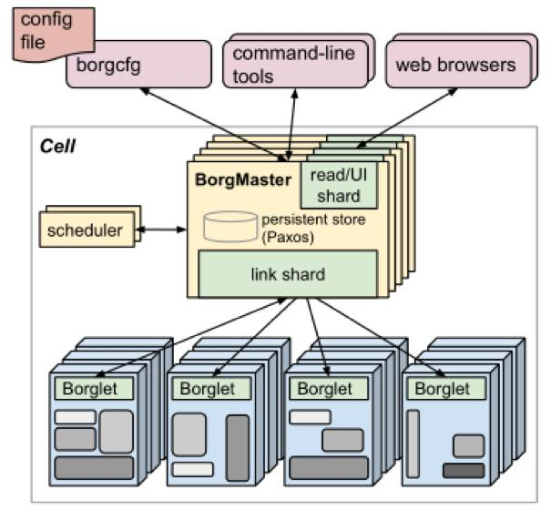
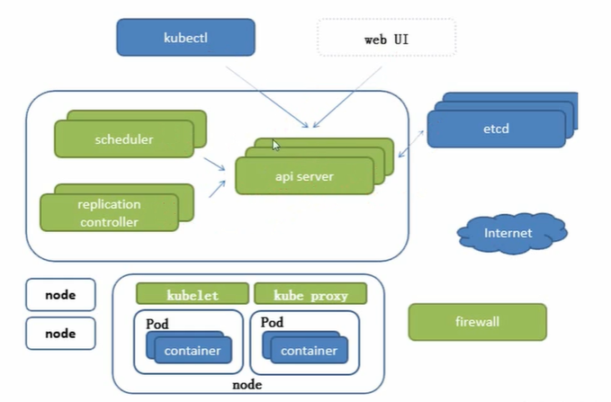

# 介绍说明

## 发展历史

- 服务
  - Infrastructure as a service， 阿里云（使用别人开发的服务完成自己的服务开发）
  - Platform as a service，新浪云（运行自己的服务）
  - Software as a service，Office 365（应用）
- 容器化
  - docker实际上已经成为PAAS的标准，但是容器集群化带来的复杂性需要资源管理器来解决
  - 资源管理器发展
    - MESOS，Apache开源的分布式资源管理框架
    - Docker Swarm，虽然支持大规模集群但是对平滑升级等支持不太好
    - K8S，Google开源的Borg实现，使用Go语言开发，轻量级，支持弹性伸缩，负载均衡（IPVS）

## 组件说明

### BORG组件

### K8S组件

> 2n+1的集群中，最多可以死亡n个节点

- etcd 可信赖的付笔数键值存储服务，V2版本写入内存，V3版本有本地持久化存储。V2版本的etcd已经在1.1.11版本的K8S中废弃
- API Server，所有服务访问的统一入口
- Replication Controller，维护副本期望数目
- Scheduler，负责选择合适的节点进行任务分配
- Kubelet，直接跟容器引擎交互实现容器的生命周期管理
- KubeProxy，通过操作firewall（IPTABLES）或者使用IPVS实现负载均衡
- COREDNS，为集群的SVC创建一个域名-IP的对应解析关系
- DASHBOARD，给K8S集群提供一个B/S结构访问体系
- INGRESS CONTROLLER，K8S只能实现四层代理，其可以实现七层代理
- FEDETATION，提供一个可以跨集群中心多K8S统一管理功能
- PROMETHEUS，集群监控
- ELK，提供集群日志统一分析入口

# 基础概念

## Pod概念

### 自主式Pod

### 管理器管理的Pod

### 服务发现

### Pod协同

## 网络通信模式

# 安装配置

# 资源清单

## 概念

## 格式

## Pod生命周期

# Pod控制器

# 服务发现

> 无状态服务与有状态服务：有状态服务DBMS，无状态服务LVS APACHE，Docker与K8S推荐使用无状态服务

## Service原理

# 存储

## ConfigMap

## Secret

## Volume

## PV

# 调度器

## 概念

## 调度亲和性

# 集群安全机制

# HELM

> yum管理器

## 概念

## 部署实例

# 运维

## 源码

## 高可用