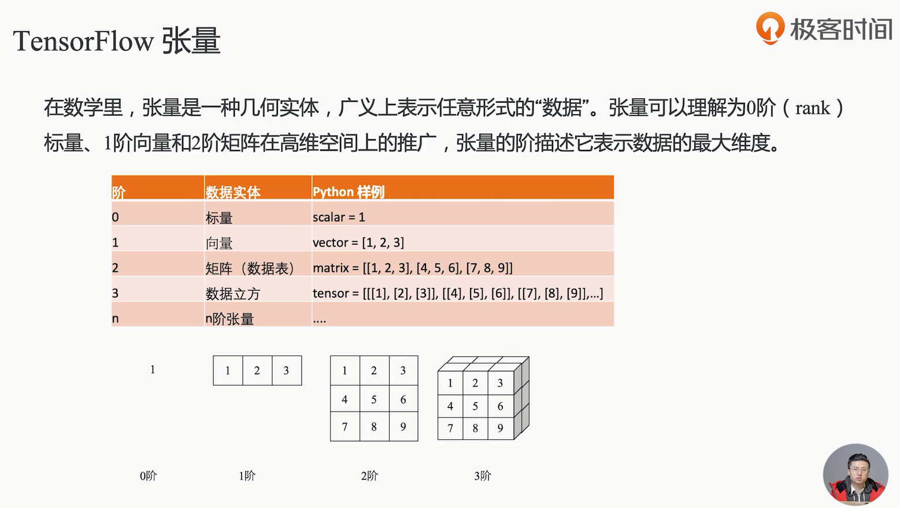
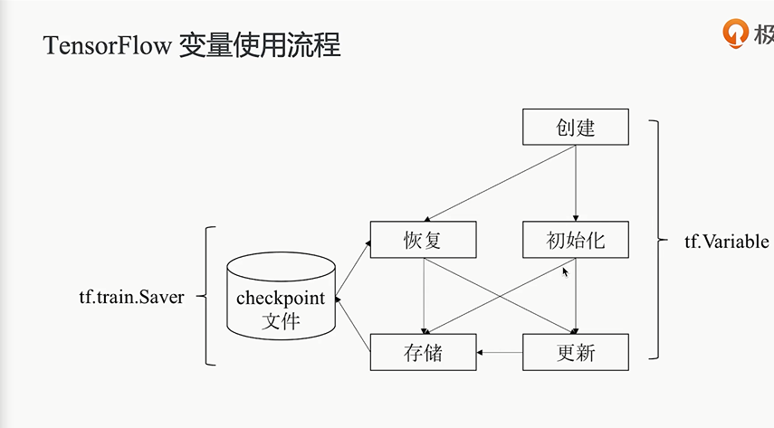

# 发展历史

- DistBelief -开源-> TensorFlow

# 安装配置

``` 
pip install tensorflow==1.15 -i https://pypi.douban.com/simple/
```

# TensorFlow知识

## 模块与架构


## 数据流图


- 优势
  - 并行计算快
  - 分布式计算快
  - 预编译优化XLA
  - 可移植性好

## 张量 Tensor




## 变量 Variable




## 操作 Operation


## 会话 Session


## 优化器 Optimizer


J(f)为模型的复杂度，是定义在假设空间上的泛函。模型f越复杂，复杂度J(f)就越大。也就是说，复杂度表示了对复杂模型的惩罚。结构风险小的模型往往对训练数据和未知的测试数据都有较好的预测。


