# 全局调整

> 缩放快捷键`CTRL + -`

## 畸变调整

### 镜头畸变

### 晕影

### 色差

### 透视畸变

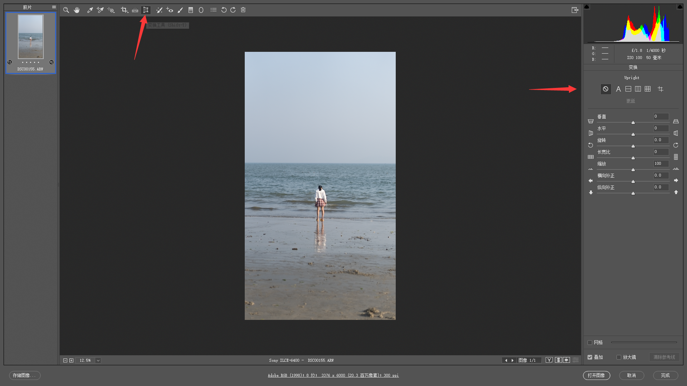

## 直方图

- 黑色->阴影->曝光->高光->白色（暗部->亮部）
- 按住`ALT`键调整，可以明显看出溢出情况（死黑或者死白）。

## ACR基本面板

### 色温

- 蓝色-黄色平衡（调节冷暖色调）
- 作用：调整白平衡、控制画面氛围

### 色调

- 绿色-洋红平衡（辅助色温调整）

### 曝光

### 对比度

- 增加对比度，亮的地方更亮，暗的地方更暗，明暗反差增强

### 高光

- 亮部

### 阴影

- 暗部

### 白色

### 黑色

### 清晰度

- 增加照片的清晰度，靠近边缘较暗的一侧会变得更亮，靠近边缘较亮的一侧会变得更暗，但是这种亮度对比的变化只局限在边缘周围的部分（增加边缘的对比度，风景照片中常用）

### 去除薄雾

### 饱和度

- 色彩浓度

### 自然饱和度

- 让饱和度的调整更加自然

## 全局调整思路

- 将照片调整通透

### 影调

- 将饱和度调整为最低即得到影调（去掉了色调），只有黑白灰三种颜色，体现了照片的明暗和轮廓。
- 由曝光、对比度、高光、阴影、白色、黑色（明亮程度）；清晰度、去除薄雾（轮廓关系）决定

### 色调

- 画面的颜色和浓度（由基本面板中的色温、色调、饱和度、自然饱和度四者构成）

# 局部调整

## RGB曲线

> 调整图片的明亮程度

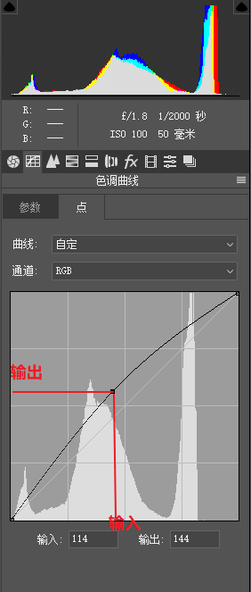

### 提亮压暗曲线

> 增强中间调

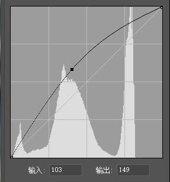

### 对比度曲线

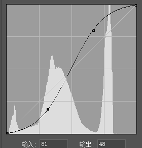

### 黑白场曲线

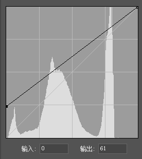

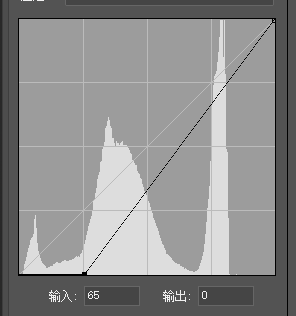

### 局部调整曲线

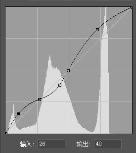

## 红绿蓝通道

### RGB与CMY

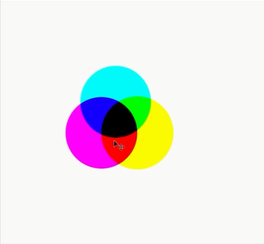

### 互为补色

- R->C，G->M（色调），B->Y（色温）
- 此消彼长

### 单通道

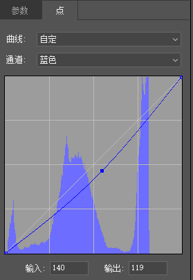

## HSL调色面板

- H 色相，把落叶由黄色改为绿色
- S 饱和度，让绿色的小草更绿
- L 明亮度，让模特的上衣变亮

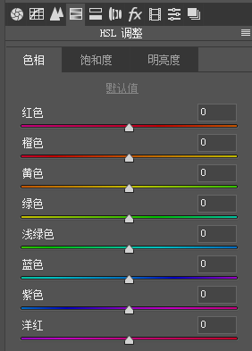

### 目标调整工具

> 通过工具获知照片局部的颜色区域

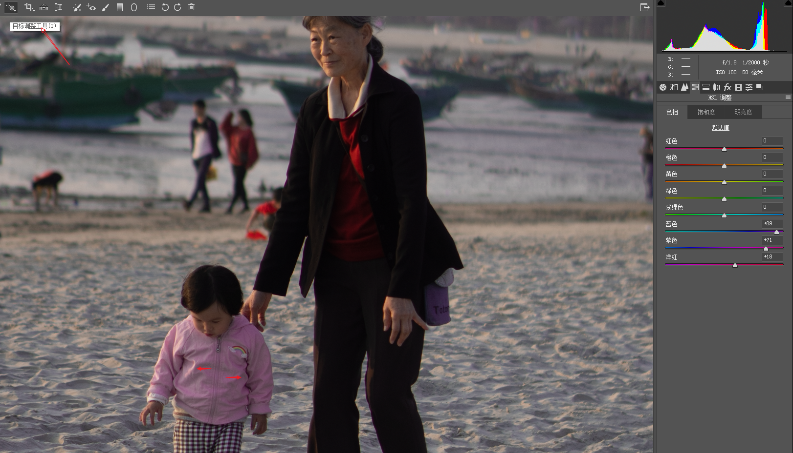

## 分离色调

> 直接给画面增加某一种色彩

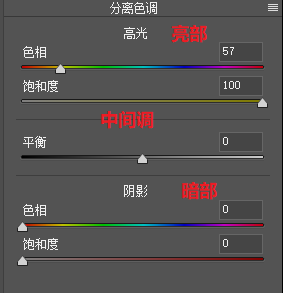

## 渐变滤镜

## 径向滤镜

> 椭圆形处理区域

## 画笔工具

> 处理不规则区域

# 风格

> 上述将照片调整得比较通透，实际上也可以按照某种风格来调整。（前期的拍摄很大程度上决定了后期的风格，不能硬改）

## 小清新风光

## 胶片风光

## 冷暖对比风格

##小清新人像

## 欧美人像

## 胶片人像

# 微调

## 去除皮肤瑕疵

## 液化五官与皮肤

## 液化身材

## 降噪与锐化