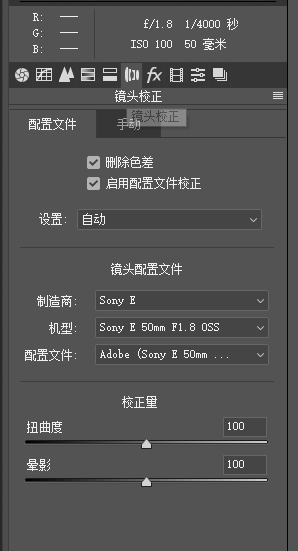
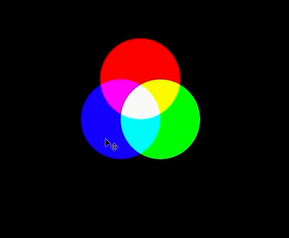
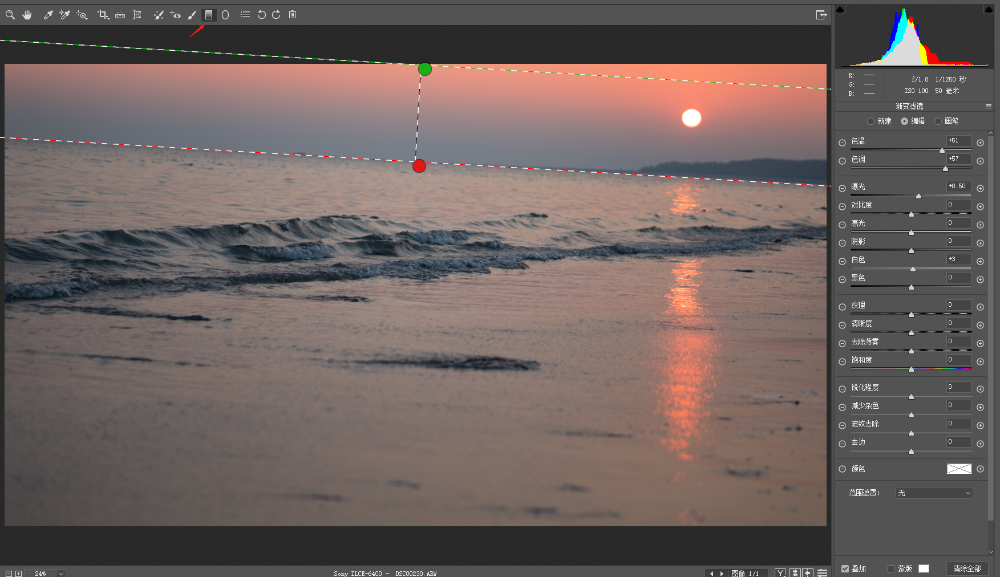
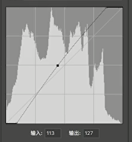
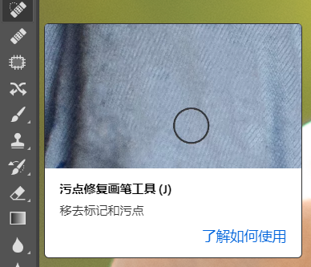
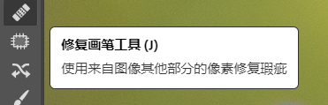
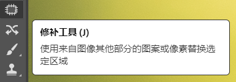
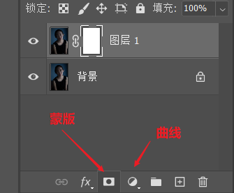
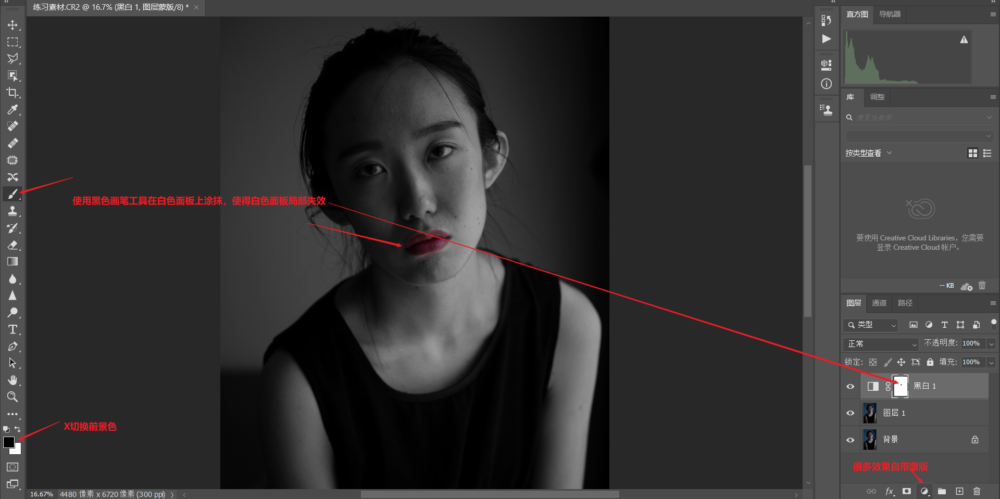

# 摄影后期笔记

# 全局调整

> 缩放快捷键`CTRL + -`，按住空格键，鼠标变成小抓手用于移动

## 畸变调整

### 镜头畸变

### 晕影

### 色差

### 透视畸变

- 一般先拉垂直参考线，再拉水平参考线

## 直方图

- 黑色->阴影->曝光->高光->白色（暗部->亮部）
- 按住`ALT`键调整，可以明显看出溢出情况（死黑或者死白）。

## ACR基本面板

### 色温

- 蓝色-黄色平衡（调节冷暖色调）
- 作用：调整白平衡、控制画面氛围

### 色调

- 绿色-洋红平衡（辅助色温调整）

### 曝光

### 对比度

- 增加对比度，亮的地方更亮，暗的地方更暗，明暗反差增强

### 高光

- 亮部

### 阴影

- 暗部

### 白色

### 黑色

### 清晰度

- 增加照片的清晰度，靠近边缘较暗的一侧会变得更亮，靠近边缘较亮的一侧会变得更暗，但是这种亮度对比的变化只局限在边缘周围的部分（增加边缘的对比度，风景照片中常用）

### 去除薄雾

### 饱和度

- 色彩浓度

### 自然饱和度

- 让饱和度的调整更加自然

## 全局调整思路

- 将照片调整通透

### 影调

- 将饱和度调整为最低即得到影调（去掉了色调），只有黑白灰三种颜色，体现了照片的明暗和轮廓。
- 由曝光、对比度、高光、阴影、白色、黑色（明亮程度）；清晰度、去除薄雾（轮廓关系）决定

### 色调

- 画面的颜色和浓度（由基本面板中的色温、色调、饱和度、自然饱和度四者构成）

# 局部调整

## RGB曲线

> 调整图片的明亮程度

### 提亮压暗曲线

> 增强中间调

### 对比度曲线

### 黑白场曲线

### 局部调整曲线

## 红绿蓝通道

### RGB与CMY

### 互为补色

- R->C，G->M（色调），B->Y（色温）
- 此消彼长

### 单通道

## HSL调色面板

- H 色相，把落叶由黄色改为绿色
- S 饱和度，让绿色的小草更绿
- L 明亮度，让模特的上衣变亮

### 目标调整工具

> 通过工具获知照片局部的颜色区域

## 分离色调

> 直接给画面增加某一种色彩

## 渐变滤镜

## 径向滤镜

> 椭圆形处理区域

## 画笔工具

> 处理不规则区域

# 风格

> 上述将照片调整得比较通透，实际上也可以按照某种风格来调整。（前期的拍摄很大程度上决定了后期的风格，不能硬改）

## 小清新风光

> 画面整体偏亮甚至稍微过曝；通透干净，整体偏蓝、偏冷，对比度低；饱和度低，杂色少，比较淡雅。

## 胶片风光

> 整体画面不太明亮，对比度稍高，暗部偏灰；带有独特的胶片色；颗粒感明显

- 胶片色：RGB三个单通道分别使用S曲线

## 冷暖对比风格

> 即蓝色与橙色、红色、黄色的对比

## 小清新人像

## 欧美人像

> 对比度高，色彩浓郁

- 十分依赖前期

## 胶片人像

# 微调

- 窗口-工作区-摄影，设置工作空间类型
- `CTRL+J`复制图层避免破坏原图！
- `[、]`调整画笔大小

## 去除皮肤瑕疵

- 污点修复画笔工具

- 修复画笔工具
  - `ALT`选取好的皮肤

- 修补工具

## 磨皮

### 磨皮插件

- 塑料感比较严重

### 双曲线

- 蒙版与曲线

> 蒙版、曲线、画笔结合，可以做到局部提亮

- 蒙版类型
  - 白色蒙版：在上面的作用可见（生效）
  - 黑色蒙版：在上面的作用不可见（不生效）
  - `CTRL+I`，切换蒙版黑白类型（反相）

- 双曲线作用
  - 亮曲线：提亮局部
  - 暗曲线：压暗局部

- 观察组
  - 一个黑白图层+一个曲线图层，`CTRL+G`分组

## 液化五官与皮肤

> 瘦脸瘦身
>
> 进入路径：滤镜-液化

- 向前变形工具：瘦脸，注意肉动骨不动
- 褶皱工具：瘦腰瘦手臂
- 膨胀工具：丰胸
- 冻结蒙版：冻结五官关系防止五官在液化过程中变形
- 人脸识别液化

## 液化身材

## 降噪

> ACR-细节面板-减少杂色-明亮度（亮度噪点）、颜色（颜色噪点）

- 基本面板-增加黑色

## 锐化

> ACR-细节面板-锐化

- 降噪之后不能过多锐化

# 输出照片

- JPEG适用于网络传播、TIFF无损格适用于打印
- 色彩空间选择SRGB避免颜色偏差
- PS中 编辑-指定配置文件选择SRGB，导出时选择`嵌入颜色配置文件`